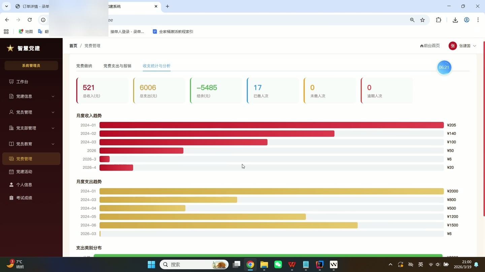
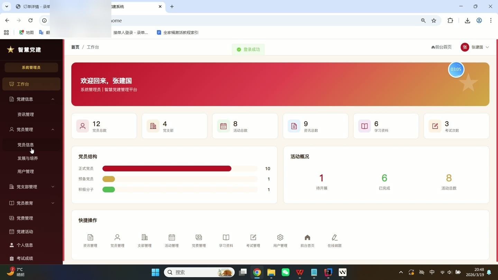
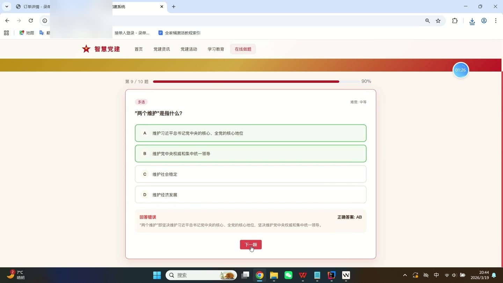
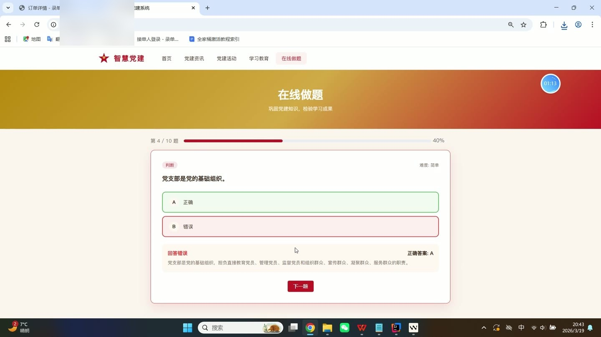

# (附文档)Springboot3+Vue3+MySQL 智慧党建系统

**技术栈**：Springboot3、Vue3、MySQL

### 智慧党建系统

### 系统简介

智慧党建系统是一套基于 Springboot3 + Vue3 前后端分离架构的党务管理平台。系统涵盖党员管理、支部建设、组织活动、在线学习考试、党费管理、新闻资讯等核心业务，支持超级管理员、支部管理员、普通党员三种角色协同工作，实现党务工作的数字化与流程化管理。

### 核心功能

### 普通用户端

- 查看个人信息（真实姓名、手机号、邮箱）并修改个人资料（性别、出生日期、民族、学历、职务、工作单位、地址）

- 浏览党建新闻列表（按分类/关键词筛选），查看新闻详情并自动累计阅读量

- 查看置顶新闻（最多5条）和最新新闻（最多8条）

- 浏览学习资料列表（按分类/关键词筛选），查看资料详情并自动累计阅读量

- 查看推荐学习资料（必修且阅读量最高的6条）

- 在线答题练习（随机抽取指定数量题目，支持按分类筛选）

- 查看考试列表（按开始时间倒序），进入考试并作答提交，获取得分/总分/及格分/是否通过结果

- 查看个人考试历史记录（分页展示，含试卷名称和提交时间）

- 对学习资料标记“已学习”，并查看个人学习记录（含资料名称和学习时间）

- 报名参与组织活动（报名后状态为 SIGNED_UP），活动签到（签到后状态变为 CHECKED_IN）

- 对已参加的活动提交反馈（文字评价 + 评分）

- 查看公开统计数据（党员总数、支部数、活动数、新闻数）

### 管理员端

- 查看管理后台仪表盘统计：党员总数、支部数、活动数、新闻数、用户数、考试数、学习资料数、正式/预备/积极分子人数、待开始/已结束活动数

- 管理党员信息：新增/编辑/删除党员（含自动创建系统账号，默认密码 123456），按姓名/类型/支部筛选，查看党员详情（关联用户信息和所属支部）

- 管理党支部：新增/编辑/删除支部，查看支部详情（含书记信息和成员列表），按名称搜索支部列表

- 管理组织活动：新增/编辑/删除活动（支持按标题/支部筛选），查看活动详情（含报名列表、签到状态），填写活动总结

- 管理党建新闻：新增/编辑/删除新闻（含标题、分类、摘要、内容、置顶开关），按分类/关键词筛选

- 管理学习资料：新增/编辑/删除资料（含标题、分类、内容、必修开关），按关键词搜索

- 管理考试题库：新增/编辑/删除题目（含题干、选项、正确答案、分类、题型），按关键词搜索

- 管理考试试卷：新增/编辑/删除试卷（含标题、总分、及格分、关联题目ID列表），查看所有考试记录

- 查看所有用户的考试记录（分页，含试卷信息和用户信息）

- 管理党费缴纳记录：新增/编辑/删除缴费记录（含用户、金额、月份、状态），按月份/状态筛选，支部管理员仅看本支部数据

- 管理党费支出记录：新增/编辑/删除支出（含金额、类型、用途、日期），审批/驳回待审核支出

- 查看党费统计仪表盘：总收入、总支出、结余、未缴/逾期/已缴数量、月度收支趋势、支出分类占比

- 管理党员发展流程：新增发展申请（自动识别积极分子→预备党员→正式党员），审核通过/驳回申请（含审核意见），查看发展记录列表

- 管理党员考评：新增/编辑/删除考评记录（含评分、评语），查看本支部党员学习统计（学习次数、考试次数、平均分、通过率）

- 管理支部考核：新增/编辑/删除支部年度考核记录（含考核年份、等级、评语）

- 查看本支部党员的学习记录详情（含资料名称和学习时间）

- 查看本支部党员的考试记录详情（含试卷名称和得分）

### 技术栈

后端框架Springboot 3
ORMMybatis-Plus
权限Spring Security + BCrypt 密码加密
前端框架Vue 3
状态管理Vuex / Pinia
构建工具Vite
数据库MySQL

### 交付内容

- 后端完整源码

- 前端完整源码

- 数据库初始化脚本

- 万字文档

## 界面展示

---

## 获取完整源码 + 万字文档

本仓库为项目介绍页。**完整前后端源码、数据库初始化脚本、万字项目文档**，请加微信 `kangkangcode`，或访问 [codekk.top](http://codekk.top) 获取。

可作课程设计 / 毕业设计参考，支持远程部署调试。